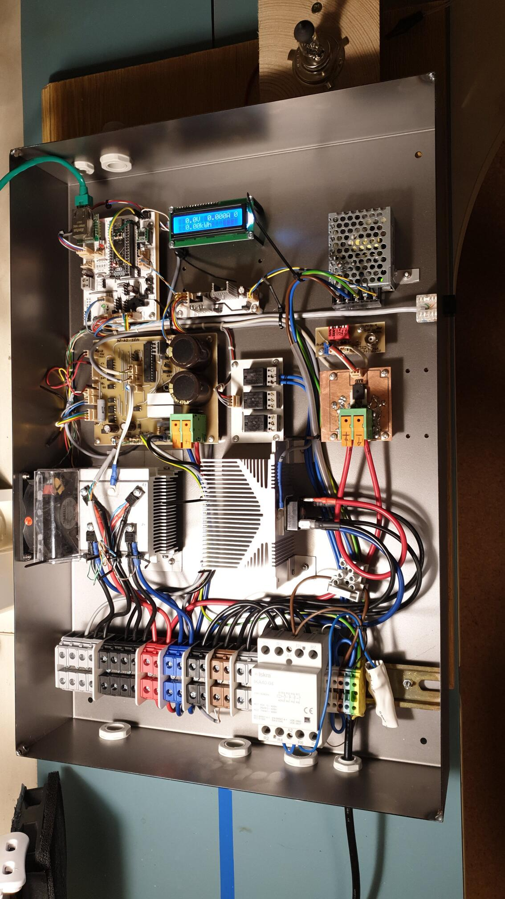

# vetrnik
Power electronics for heating water using power generated by a small wind
turbine.




## Features / design goals
- No battery.
- Maximum power point tracking.
- Power to resistive heating elements must be AC to prevent electrolytic
  corrosion.
- MQTT telemetry.
- Home Assistant integration via MQTT.
- Energy meter.
- Calculates RPM from wind turbine AC output frequency.
- Survives full 50 V / 40 A during normal operation, as well as significantly
  higher open-circuit voltage.


The device offers a feature-rich command line interface:
```
vetrnik-control:$ help
---- Available commands ----

SPIflash: Issue commands to SPI flash
conf: Get or set configuration options.
control: Get or set params of control algorithm.
debug: Filter debug messages
dfu: Switch to DFU firmware download mode.
ds18b20: Print out DS18B20 sensor readings
free: Print out amount of free memory.
ifconfig: Print out networking information.
lisp: Process a line of Lisp
lisp_read: Execute Lisp from file
lisp_reset: Reinit Lisp interpreter
log: Print log / postmort
millis: Returns the number of milliseconds passed since the program started.
mqtt: Print out MQTT status.
onewirescan: Scan devices on onewire bus
ota: Switch to over-the-air firmware dl mode.
power: Print status of power PCB or set params.
pump: Control circulation pump.
reset: Reset the MCU.
rx: Print out RX_datapoints.
rx_raw: Toggle printing of messages from power board.
stats: Get stats (energy, ...)
tx: Set value of TX datapoint.
tx_raw: Transmit message to power board.
uptime: Returns the time passed since the program started.
ver: Print out version info.
watch: Run command every second.

vetrnik-control:$ stats
stats:
energy: 0.000 kWh

vetrnik-control:$ power
power board status:
retrieved_millis: 2274816315
valid: 1
time: 56810 s
mode: 2
duty: 0 (0-255)
OCP_max_duty: 255 (0-255)
RPM: 0 RPM
voltage: 0.0 V
current: 0.000 A
enabled.hardware: 1
enabled.software: 1
enabled.overall: 1
emergency: 0
temperature_heatsink: 16.3 'C
temperature_rectifier: 16.4 'C
fan: 0
error_count: 0
last5m: 0

vetrnik-control:$ ds18b20
This command does NOT request a new conversion.
[0] voda: 28.93 C
[1] : 0.00 C
[2] : 0.00 C
[3] : 0.00 C
[4] : 0.00 C
[5] : 0.00 C
[6] : 0.00 C
[7] : 0.00 C
[8] : 0.00 C
[9] : 0.00 C

vetrnik-control:$
```


## Hardware details
See [`hardware/`](hardware/).
